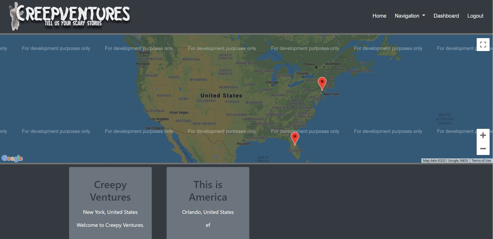
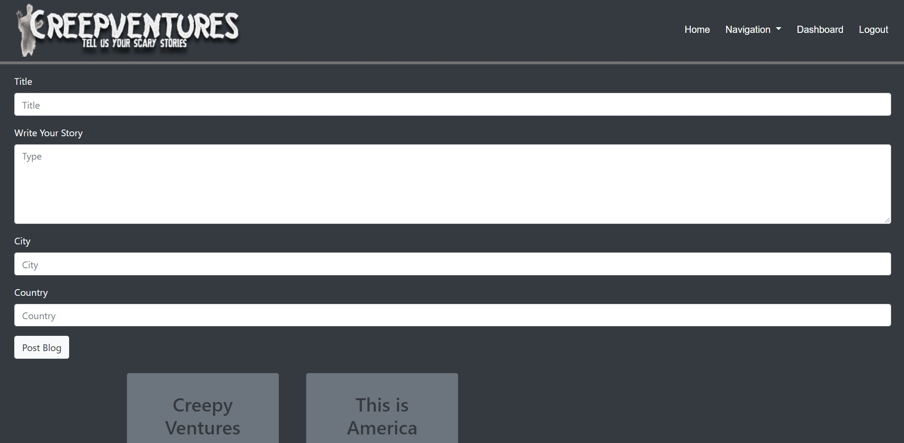
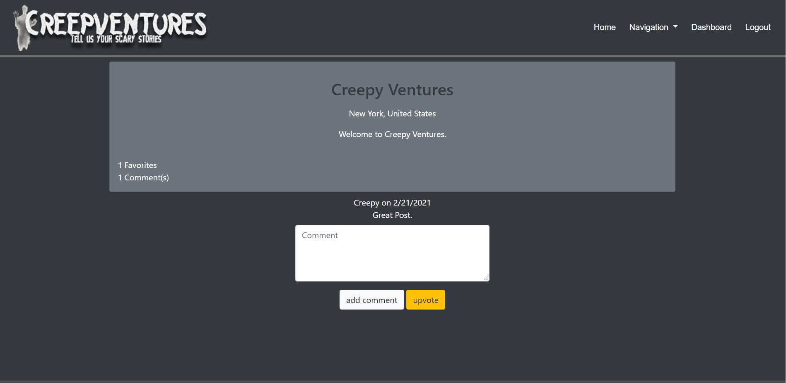

  # Creepy Ventures 

  ## Description
  Creepventures is a social media based blog system that allows users, once they register, to make posts and add locations of haunted locations that reflect on the map on the home page. Once logged in, they are able to make comments and favorite posts on their dashboard. They are able to edit and delete their own posts and interact with other users on the posts through the comments.

  ## Table of Contents
  * [Installation](#installation)
  * [Usage](#usage)
  * [License](#license)
  * [Questions](#questions)
  

  ## Installation
    Make sure to have the following installations in place as your dependencies. 
    - bcrypt
    - connect-session-sequelize
    - custom-env
    - dotenv
    - express
    - express-handlebars
    - express-session
    - handlebars
    - hbs
    - mysql2
    - sequelize

  ## Usage
  You will use this project to post about haunted travel destinations. 
   
  The homepage of the website.
   
   
    
  The dasboard of the website.
   
   
    
  The view of a single post.
   
   
    
  Link to Github: https://github.com/reaganjoseph26/creepy-ventures.git
   
  Link to deployed application on Heroku: https://peaceful-stream-83088.herokuapp.com/

  ## License
  This licence is covered undered (https://opensource.org/licenses/MIT).
  

  ## Questions
  If you have any additional questions, please reach out to me. 
  You can reachout to me at my GitHub profile, which is [reaganjoseph26](https://github.com/reaganjoseph26).
  Also, you can reach out to me by email. My email address is reaganjoseph26@yahoo.com. 
  

